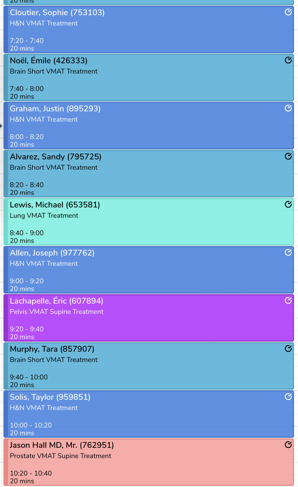
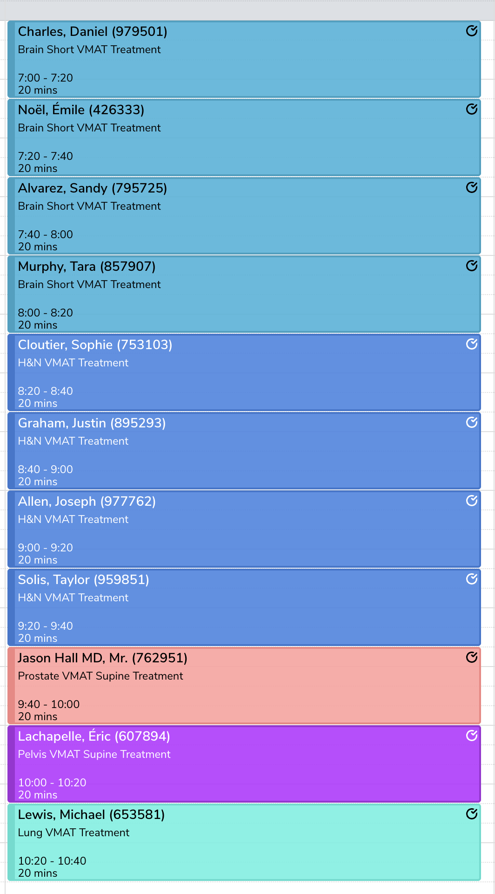

# GrayOS Technique Clustering Problem
# GrayOS technique clustering challenge

## Background

In radiation therapy (RT), treatments are typically **fractionated**: patients return to the hospital on multiple consecutive days to receive part of their prescribed radiation dose.  
A standard RT session lasts 15–25 minutes, but only ~2 minutes involve actual radiation delivery. The bulk of the time is spent on **precise patient positioning**, often using cancer site–specific accessories.

When scheduling machines, efficiency improves if appointments requiring the **same accessories** are grouped together. This reduces setup changes and creates a smoother workflow.  
We call this **“technique clustering.”** GrayOS includes a scheduling optimizer that suggests appointment time adjustments to maximize clustering while respecting patient-specific constraints.

Here is an example with two ways to plan a sequence of appointments, one is badly clustered and one is well clustered.

## Task

You will be given:
- A **current daily schedule** for multiple machines  
- A set of **proposed modifications** generated by our clustering algorithm  

Your goal is to build a UI that:
- Displays the schedule **before and after optimization**  
- Clearly shows which appointments were clustered more efficiently  
- Highlights changes in appointment times  
- Groups appointments visually by ownership to a cluster  

## Notes

- Each appointment has a `technique` describing the treatment.  
- A **cluster** definition may include multiple techniques that share the same setup procedure. 

## Deliverables

- Source code forked from this repository  
- A short write-up explaining design choices and possible future improvements  

## Tips

- Prioritize **intuitive, clean UX**  
- Use a **calendar-style view**  
- You may add or replace dependencies as needed  